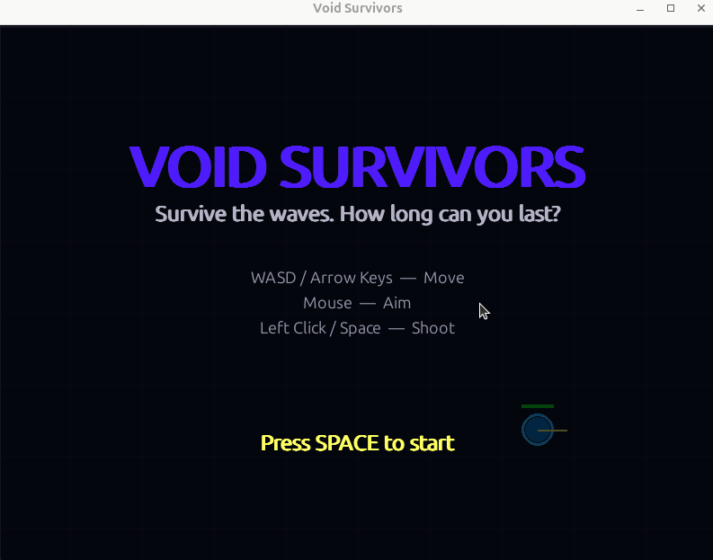
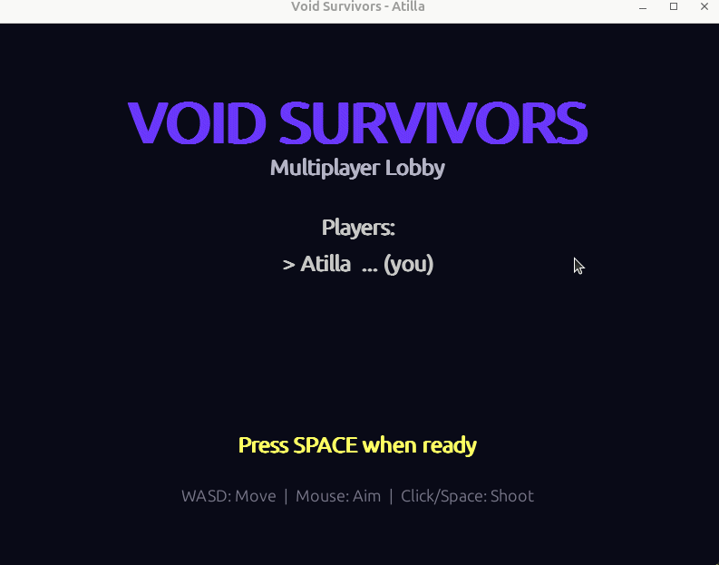

# Void Survivors

A top-down space arena survival shooter built with [pygame](https://www.pygame.org/).  
Survive increasingly difficult waves of enemies, collect powerups, and aim for the highest score.



## Gameplay

You control a spaceship in a dark void. Enemies spawn in waves from the edges of the arena, each wave harder than the last. Use your mouse to aim and shoot, and your keyboard to dodge. Killed enemies have a chance to drop powerups that heal you, boost your speed, or give you a triple-shot spread.

**The game gets progressively harder:**

| Wave | New Enemy Introduced |
|------|---------------------|
| 1    | Basic (red circles) — standard homing enemies |
| 2+   | Fast (orange diamonds) — quick zigzaggers |
| 3+   | Shooter (green hexagons) — keeps distance, fires bullets at you |
| 4+   | Tank (purple circles) — slow, large, high health |
| 5, 10, 15... | Boss (red spiky) — too many bullets, gets stronger each time |
## Controls

| Key | Action |
|-----|--------|
| `W` / `↑` | Move up |
| `A` / `←` | Move left |
| `S` / `↓` | Move down |
| `D` / `→` | Move right |
| **Mouse** | Aim direction |
| **Left Click** / `Space` | Shoot |
| `ESC` | Pause the game |
| `R` | Restart (paused / game over screen) |
| `Q` | Quit (paused / game over screen) |
| `M` | Toggle difficulty level |

## Powerups

Powerups drop randomly when you kill an enemy (30% chance):

| Powerup | Color | Effect |
|---------|-------|--------|
| Health  | Green (+) | Restores 30 HP |
| Speed   | Yellow (⚡) | 6 seconds of faster movement |
| Multi-Shot | Blue (•••) | 8 seconds of triple bullet spread |

## Special Effects

- **Particle explosions** on enemy death, hits, and player damage
- **Screen shake** on impacts (stronger for bigger events)
- **Player trail** that follows your movement
- **Blinking invincibility** after taking damage
- **Pulsing powerups** with glow animation
- **Fading wave announcements**

## Difficulty levels

- Normal: 100 HP
- Hard: 50 HP
- Impossible: 1 HP

## Installation

### Prerequisites

- Python 3.8 or higher
- pip (Python package manager)
- pygame and pyzmq (installed via requirements.txt)

### Setup

```bash
# Clone the repository
git clone https://github.com/atillasahin28/void_survivors.git

# Install dependencies
pip install -r requirements.txt
```

### Run the game

```bash
cd void_survivors
python main.py
```

## Multiplayer

The game supports networked multiplayer using zmq (REQ/REP pattern). One player runs the server, others connect as clients. All players share the same arena and fight enemies together.



### How to play multiplayer

All players need to be on the **same network** (same WiFi). One player hosts the server, the others connect to it.

**Step 1 — Host finds their IP address:**
```bash
hostname -I
```
This gives something like `192.168.1.42`. Share this IP with the other players.

**Step 2 — Host starts the server and joins as a player (two terminals):**
```bash
# Terminal 1: start the server
python3 mp_server.py 2345 0.0.0.0

# Terminal 2: join your own server
python3 mp_client.py Alice 2345 192.168.1.42
```

**Step 3 — Other players connect using the host's IP:**
```bash
python3 mp_client.py Bob 2345 192.168.1.42
```

Replace `Alice`/`Bob` with your name and `192.168.1.42` with the actual IP from step 1.

Once everyone has joined, each player presses SPACE to ready up. The game starts after all players are ready.


## Project Structure

```
void_survivors/
├── README.md              ← You are here
├── requirements.txt       ← Python dependencies
├── main.py                ← Entry point
├── game.py                ← Main game loop, collision detection, state
├── camera.py              ← Smooth-follow camera with screen shake
├── wave_manager.py        ← Enemy wave spawning and difficulty
├── hud.py                 ← Score, health, wave display
├── mp_server.py           ← Multiplayer server
├── mp_client.py           ← Multiplayer client
├── mp_action.py           ← Shared action class for client-server
└── units/                 ← All game entities (polymorphism)
    ├── __init__.py
    ├── unit.py            ← Abstract base class for all entities
    ├── player.py          ← Player (WASD + mouse aim)
    ├── bullet.py          ← PlayerBullet and EnemyBullet
    ├── enemy.py           ← BasicEnemy, FastEnemy, TankEnemy, ShooterEnemy, BossEnemy
    ├── powerup.py         ← HealthPowerUp, SpeedPowerUp, MultiShotPowerUp
    └── particle.py        ← Particle effects and ExplosionEffect factory
```

## Architecture

The game follows **object-oriented design with polymorphism** as the core pattern:

- **`Unit` (ABC)** — Abstract base class. Every entity in the game inherits from it, providing shared position/speed physics, collision detection, and screen rendering. Subclasses override `update()` and `draw()` for unique behaviors.
- **`Game`** — Orchestrates the main loop, owns all unit lists, and handles collision detection between different unit types.
- **`Camera`** — Smooth-follow camera that keeps the player centered, with screen shake support.
- **`WaveManager`** — Strategy for enemy spawning, increasing difficulty each wave.
- **`HUD`** — Screen-space UI rendering, decoupled from game logic.
- **`ServerGame`** — Server-side game logic for multiplayer, reusing the same unit classes.
- **`GameRenderer`** — Client-side renderer for multiplayer, draws game state from server snapshots.

### Class Hierarchy

```
Unit (ABC)
├── Player
├── PlayerBullet
├── EnemyBullet
├── BasicEnemy
├── FastEnemy
├── TankEnemy
├── ShooterEnemy
├── BossEnemy
├── PowerUpBase (ABC)
│   ├── HealthPowerUp
│   ├── SpeedPowerUp
│   └── MultiShotPowerUp
└── Particle
```

## Team Contributions

Tracked via Git commit history. All team members contributed to design, implementation, and testing.

## License

This project was created for the Software Engineering course at UvA (2026).
